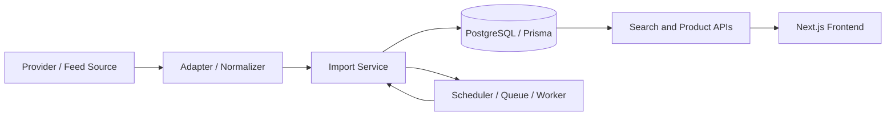

# Architecture Guide

This document explains the main architectural layers of PriceLance and how the repository is organized for a technical buyer who needs to understand the system quickly. For local setup, see [docs/ONBOARDING.md](ONBOARDING.md). For production deployment, see [docs/DEPLOYMENT.md](DEPLOYMENT.md). For commercial handoff context, see [docs/BUYER_HANDOFF.md](BUYER_HANDOFF.md).

## 1. System overview

PriceLance is an ingestion-first application for collecting product data, normalizing listings, and making them available through search and admin APIs. The application is built around a small number of core concerns:

- ingesting data from external sources
- storing normalized product and listing records
- serving search and product APIs
- exposing admin tooling for import and monitoring workflows

The implementation is organized as a Next.js application with server-side route handlers and a Prisma-backed persistence layer.

## 2. Repository layout

The repository is structured around a few primary areas:

- src/app — application routes, UI entry points, and API handlers
- src/components — reusable UI components
- src/lib — domain services, provider adapters, ingestion logic, auth helpers, and shared utilities
- src/config — configuration and feature flags
- prisma — Prisma schema and seed logic
- scripts — maintenance and ingestion operations
- tests and fixtures — sample data and test utilities
- docs — buyer-facing documentation and operational notes

## 3. Frontend architecture

The frontend uses Next.js App Router pages and route handlers. The main UI is driven by server-rendered pages and client-side interactions for search, filtering, and admin workflows.

The main responsibilities of the frontend layer are:

- rendering the main product search experience
- surfacing listing details and product cards
- exposing admin flows for imports and system checks
- connecting to internal APIs for data retrieval and operational actions

## 4. Backend architecture

The backend is composed of route handlers under src/app/api and a set of shared services under src/lib.

The backend responsibilities are:

- accepting product search requests
- processing import workflows
- orchestrating provider calls and normalization
- enforcing internal and admin access rules
- reading and writing to PostgreSQL through Prisma

A practical mental model is that the app route layer coordinates requests while the lib layer contains the domain-specific logic.

## 5. Provider system

The provider system is the abstraction layer for external data sources.

Key pieces:

- src/config/providerConfig.ts — feature flags and provider enablement definitions
- src/lib/providers/index.ts — provider registration and runtime selection
- src/lib/providers/* — concrete provider implementations

Providers are selected at runtime based on configuration and are intended to be added or changed without rewriting the ingestion pipeline itself. The provider layer is responsible for translating source-specific payloads into the internal listing model.

**Provider implementation states:** The codebase includes implementations for various providers (such as RapidAPI-style search, eBay, Banggood, and affiliate integrations). However, individual provider implementations can have different states depending on deployment configuration: active, optional, demo-only, dormant, or disabled. The presence of provider code does not mean that provider is currently active in production. For clarity on which providers are currently implemented, enabled, and active in the codebase, see [docs/BUYER_HANDOFF.md](BUYER_HANDOFF.md) and [docs/DEPLOYMENT.md](DEPLOYMENT.md).

## 6. Ingestion pipeline overview

The ingestion pipeline is the core operational workflow of the system.

A typical flow looks like this:

1. A source arrives from a CSV upload, a URL-based feed, or an affiliate provider.
2. A provider or adapter normalizes the input into a common listing shape.
3. The import service creates or matches products and listings.
4. The database records are updated with product metadata, listing data, and any associated merchant information.
5. The application can then surface those records through search, browse, and analytics APIs.

The central import service is the place where ingestion paths should converge. This is the recommended integration point for new sources.

## 7. Scheduler, queue, and worker

PriceLance uses a scheduled ingestion pattern built around a queue and background worker. **These components are optional and used only when queue-based or scheduled ingestion is enabled.**

- Scheduler — defines recurring ingestion jobs based on environment-driven configuration
- Queue — stores job payloads for asynchronous processing
- Worker — executes jobs such as CSV imports, URL imports, and affiliate imports

This design allows ingestion to be run asynchronously rather than strictly inline in a request handler. It is also the right place to add retry, pacing, and operational visibility later.

The basic web application and database-backed browsing/search functionality do not require the background ingestion stack. The scheduler, queue, and worker are only necessary when the buyer enables queue-based or scheduled ingestion workflows.

## 8. Database model overview

The Prisma schema is the primary definition of the persistence layer. The core entities are:

- Product — canonical product record with name, brand, category, and metadata
- Listing — store-specific offer or listing tied to a product
- ProductPriceHistory — historical price points for a product or listing over time
- Merchant — merchant or feed owner metadata
- MerchantFeedRun — summary of import runs associated with a merchant feed
- SearchLog — search activity recorded for analytics and monitoring
- SavedSearch — persisted search filters for users

The database design is intentionally simple: products are the canonical entities, while listings are the store- and offer-specific rows attached to them.

## 9. API layer

The application exposes several categories of API endpoints:

- Public APIs for search, browse, and product retrieval
- Internal APIs for operational tooling and protected maintenance workflows
- Admin APIs for imports, monitoring, and administration functions

The API layer is relatively thin. It is responsible for validating input, enforcing access rules, and delegating work to shared services.

## 10. Search flow

Search requests flow from the frontend into a product API route, which queries the database using product and listing data. The implementation then filters, sorts, and normalizes the results before returning them to the UI.

This layer is also where category handling and some business rules are applied, such as filtering out certain listing types or normalizing store values.

## 11. Price history flow

Price history is stored as records that describe historical prices over time. The import and listing workflows are the main source of new price points, and the frontend can then render historical price trends for products.

This means PriceLance is not only a listing search app; it also maintains a historical record useful for comparison and analysis.

## 12. Admin subsystem

The admin subsystem is a separate operational surface for maintaining and monitoring the platform.

It includes pages and routes for:

- importing data from CSV files
- reviewing merchant feeds
- checking system status
- inspecting ingestion and search activity

Because these flows are operationally sensitive, they rely on server-side configuration and protection rules rather than purely client-side access control.

## 13. Extension points

The existing architecture is already structured around a few extension seams:

- Add a new provider by implementing the provider interface and registering it in the provider configuration.
- Add a new ingestion source by extending the import pipeline and associated adapter logic.
- Add a new admin or monitoring surface by introducing a route and a service layer under src/app or src/lib.
- Add new analytics or enrichment logic by working through the shared services rather than the UI layer.

## 14. Future scalability

For a larger deployment, the current architecture would benefit from additional separation between:

- ingestion workers and web request handling
- background job observability and retries
- caching and read-path optimization
- more explicit queue monitoring and operational alerting

The current structure is suitable for local and moderate-scale evaluation, and it provides a clear path to more production-oriented scaling.

## 15. Main runtime flow

This diagram captures the essential architecture: providers feed data into the normalization and import flow, which updates the database and powers the frontend experience.
